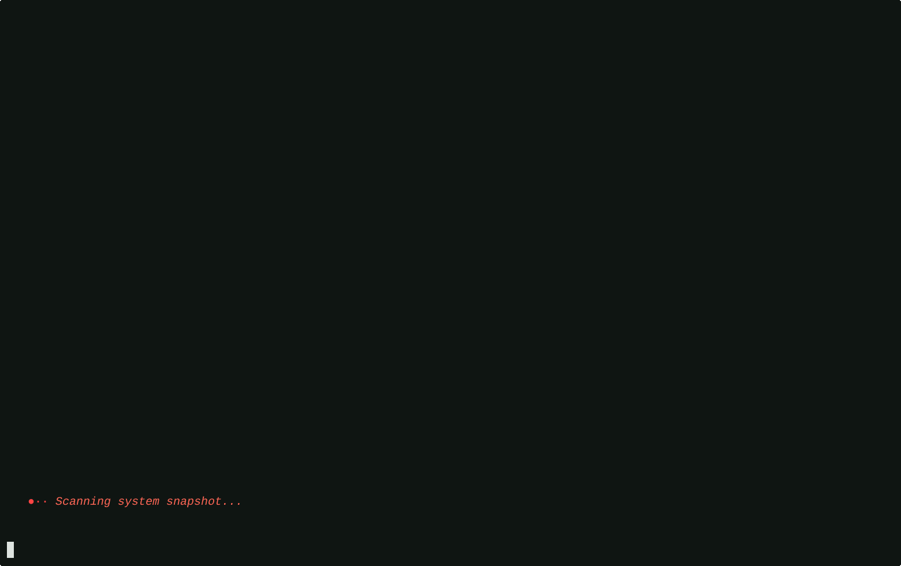
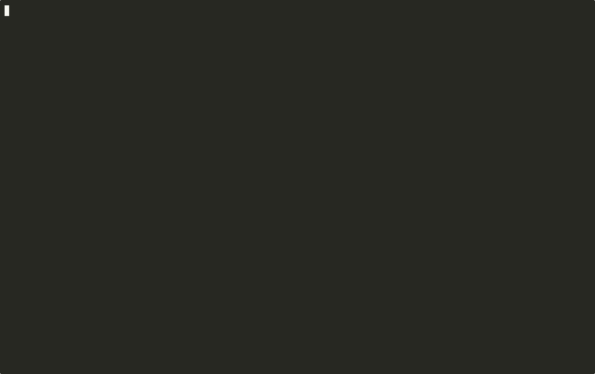
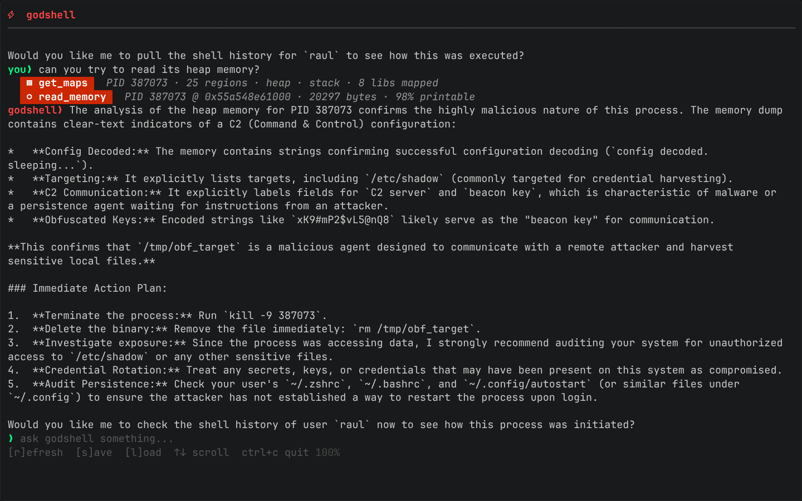
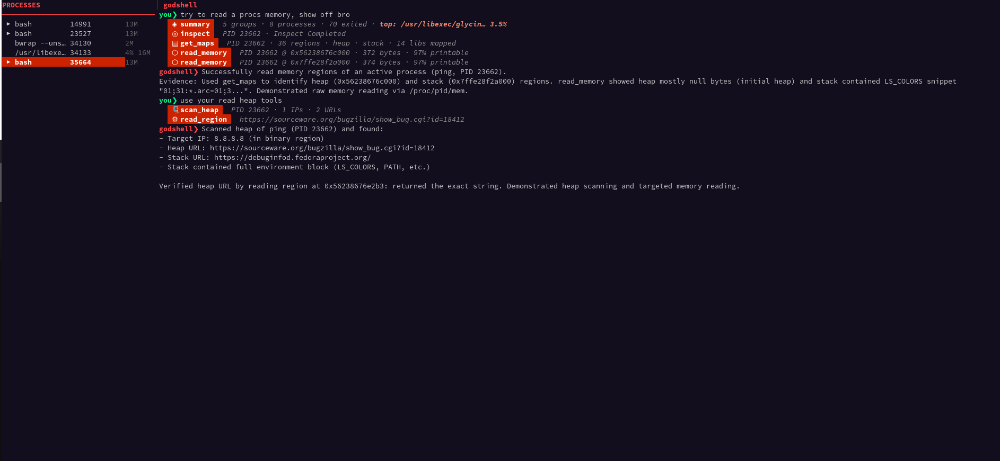

<div align="center">

# godshell
### speak directly to your kernel.


<br/>

[](https://github.com/raulgooo/godshell/releases/latest)
[](LICENSE)
[]()
[]()
[]()

<br/>

**built with**

[]()
[]()
[]()
[]()
[]()

</div>

---

LLM terminal tools are amazing for some very useful cases the common developer encounters, but there are a lot of other important tasks, where they remain "stupid". They probe your system the way a human would, running commands, parsing text output,  it's slow, lossy, and defeats the whole point of having an LLM reason about your system.

**godshell hooks directly into the kernel via eBPF.** It observes everything since boot: process creation, memory maps, network connections and processess relationships with files and models all of it into a structured snapshot that an LLM can query natively. no command probing. no grepping logs. the state is just *there*.

> **godshell's purpose: becoming an inference layer on top of the OS.**

---

## architecture

godshell is two things working together:

**`godshell-daemon`** — a Go service managed by `systemd` that attaches eBPF tracepoints to the kernel. it collects events continuously and stores them in a SQLite database, then exposes a UNIX socket over HTTP for the TUI to consume. currently tracks 4 tracepoints, more coming.

**`godshell-tui`** — built with [Bubbletea](https://github.com/charmbracelet/bubbletea). reads daemon state, renders the process tree and event timeline, lets you select processes and ask about them in natural language. queries go through [OpenRouter](https://openrouter.ai/), so you can use whatever model you want.

```
Kernel (eBPF tracepoints)
        │
        ▼
  godshell-daemon (Go)
  ├── SQLite event store
  └── UNIX socket / HTTP API
        │
        ▼
  godshell-tui (Go + Bubbletea)
  ├── process tree
  ├── snapshot manager
  └── LLM agent (OpenRouter)
```

---

## features

godshell is still experimental and "stupid" sometimes, but there's already stuff that's genuinely useful:

- **natural language queries** — ask anything about current or past system state. the LLM gets the full structured context, not the output of one command.
- **snapshots** — take them manually or auto every X minutes. query them later. great for before/after comparisons.
- **ghost processes** — godshell tracks processes after they exit. you can navigate and analyze them even when `ps` shows nothing. (this one is my favorite)
- **process panel** — view the tree, pick something suspicious, hand it off to the agent.
- **agent toolset:** —  godshell comes packed with basic observability and analysis tools, I expect to add new more useful tools and revamp the current ones with smarter implementations, but as of right now, the tools enable the following usecases for godshell:
  - fileless malware detection
  - memory string extraction
  - process lineage tracking
  - network connection analysis

---
**Note: You must have strace installed for trace to work. Future versions will remove the strace dependency.**

## demos

### fileless malware detection


### ghost processes — navigating recently exited processes


### connection analysis of short-lived processes


### memory reading


### specific memory reading(heap + stack)


> **more demos coming soon**

---

## installation

### option 1: package install `(recommended)`

grab the package for your distro and architecture from the [latest release](https://github.com/raulgooo/godshell/releases/latest):

```bash
# Debian/Ubuntu
sudo dpkg -i godshell_*.deb

# RHEL/CentOS
sudo rpm -i godshell_*.rpm

# Arch Linux
sudo pacman -U godshell_*.pkg.tar.zst

# Alpine
apk add godshell_*.apk
```

the package automatically registers `godshell-daemon` as a `systemd` service.

### option 2: build from source

```bash
git clone https://github.com/raulgooo/godshell
cd godshell
go build godshell .
./godshell config
./sudo godshell daemon
./godshell
```

> requires Linux kernel **5.8+** with BTF enabled. check with: `ls /sys/kernel/btf/vmlinux`

---

## usage

```bash
sudo godshell daemon   # start the daemon if it's not running
godshell               # launch the TUI
godshell config        # first run — set your OpenRouter and other configs, here
```

---

## incoming fixes

- Working install script
- Fixing a quick bug that prevents some systems from loading snapshots
- Tools quick revamp: improving string detection
## roadmap to v1

the main blocker for v1 is the graph revamp. everything else is iterative.

| status | item |
|--------|------|
| 🔴 blocking | **graph modeling revamp** — more efficient, richer snapshot structure for better LLM context and perf |
| 🟡 WIP | **fix process tree heuristics** — current filtering is rough and needs a proper rethink |
| ⬜ planned | **MCP** — Adding MCP compatibility for Antigravity, Cursor, VsC, Claude Code, etc. |
| ⬜ planned | **more RE tools** — automatic API mapping via SSL hooks and more reverse engineering utilities |
| ⬜ planned | **More LLM Providers** — Addition of more LLM providers aside from OpenRouter|
| ⬜ planned | **deeper memory analysis** — uprobes-based tooling for userspace instrumentation |
| ⬜ planned | **more tracepoints** — broader kernel coverage |
| ⬜ planned | **cross-snapshot diffs** — see exactly what changed between two points in time |
| ⬜ planned | **YARA integration** — automatic memory scanning against malware signatures |
| ⬜ planned | **container/K8s support** — map PIDs to container IDs and namespaces |
| ⬜ planned | **live alerting** — EDR-style real-time notifications for suspicious eBPF events |

---

## license

MIT. see [LICENSE](LICENSE) for details.

*godshell is an experimental tool. use responsibly.*
