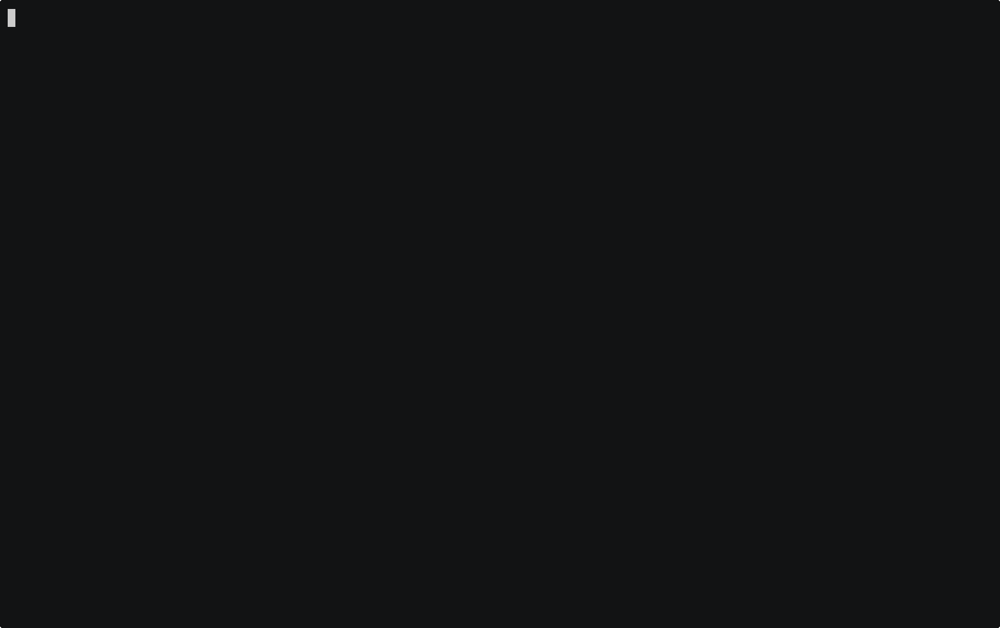

# 👻 Godshell



- A new way to interact with your kernel

**godshell.**

Most LLM-native terminals are "probing-first": they run `top`, `ps`, and `ls` every time you ask a question. **Godshell** is "observation-first". It uses eBPF to watch your kernel's internal events since the moment it started.

When you ask "Why did that command fail?" or "What touched my SSH keys?", Godshell doesn't probe. It already has the answer.

---

## 🚀 The Difference

> **You**: "Why is the system sluggish?"
>
> **Godshell**: `rust-analyzer` (PID 9012) has been at 89% CPU for 14 minutes, triggered after you opened `main.rs`. It is currently indexing the workspace. **Kill it?**

Unlike other tools, Godshell stays resident. Its eBPF observers capture:

- **Process Lifecycles**: Every `execve` and `exit`.
- **File Access**: Every `openat` (track exactly who touched your secrets).
- **Network Flows**: Every outbound TCP connection, matched to the process.
- **Memory Forensics**: Real-time heap scanning and anonymous region inspection.
- **TLS Interception**: Transparently intercept SSL/TLS traffic from `libssl`, `nss`, and Go binaries.

---

## 🛠️ Installation

Godshell requires a modern Linux kernel (5.8+) with BTF enabled.

```bash
git clone https://github.com/raul/godshell
cd godshell
sudo ./setup.sh
```

The setup script installs all kernel dependencies (`clang`, `libbpf-dev`, etc.) and compiles the eBPF probes and Go binary in one go.

---

## 🧠 Architecture

Godshell treats your OS state as a series of immutable snapshots.

1.  **eBPF Probes**: High-performance C programs attached to kernel tracepoints.
2.  **Observer Daemon**: Collects events via BPF ring buffers with near-zero overhead.
3.  **Context Engine**: Correlates events into a structured "System Snapshot".
4.  **LLM Bridge**: An AI agent (Gemini 2.5 via OpenRouter) that uses the snapshot as its ground truth.

---

## 🛡️ Key Capabilities

- **Fileless Malware Detection**: Identifies processes that have deleted their own binary from disk and are running purely in memory.
- **Memory String Extraction**: Scans process heaps for hardcoded keys, C2 configurations, and hidden URLs.
- **SSL Interception**: View the plaintext of outbound HTTPS requests from browsers, `curl`, or your own Go/Python/Node services without configuring proxies.
- **Lineage Tracking**: Reconstruct the ancestor tree of any process, even if the parent has already exited.

---

## 📖 Usage

```bash
sudo ./godshell
```

Root privileges are required to load eBPF programs and read `/proc/pid/mem`.

### Interactive TUI

Godshell features a dual-panel interface:

- **Left Panel**: A navigable process tree. Select a process with `Enter` or `j/k`.
- **Right Panel**: Conversational forensics. Ask Godshell anything about the system or the selected process.

---

## 🧱 Build System

We provide a comprehensive `Makefile` for developers:

- `make`: Compiles everything.
- `make ebpf`: Recompiles the BPF C code and generates Go loaders.
- `make test`: Runs the forensics test suite.
- `make clean`: Removes all build artifacts.

---

## 🗺️ Roadmap

- [ ] **Cross-Snapshot Diffs**: See exactly what changed between two points in time.
- [ ] **YARA Integration**: Automatically scan process memory for malware signatures.
- [ ] **Container/K8s Support**: Map PIDs back to container IDs and namespaces.
- [ ] **Live Alerting**: EDR-style real-time notifications for suspicious eBPF events.

---

## ⚖️ License

MIT. See [LICENSE](LICENSE) for details.

_Godshell is an investigatory tool for security engineers. Use responsibly._
